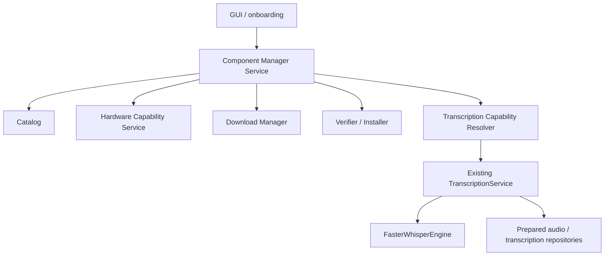

# Component Manager and Local Transcription Foundation v32

## Goal

Design a guided, non-technical, managed local component experience for:

- FFmpeg
- transcription runtime
- transcription models

The current stack already works, but it is not yet a component manager. v32 should make installation, verification, relocation, repair, and capability resolution explicit and safe.

## Product Decisions Already Approved

- Default experience: `Install recommended`
- Default profile: `Balanced`
- Drivers are out of scope
- Heavy components download on demand
- Downloads must be pausable and resumable
- Models may be moved to another drive
- A component can activate only after verification, hash validation, and a functional test
- Current transcription remains behind a future `TranscriptionCapabilityResolver`
- No advanced diarization yet
- No audio leaves the machine without explicit approval
- The app may continue in limited mode
- UI must be guided and simple; technical details belong in advanced mode
- First implementation must include onboarding and a local components screen

## Existing Contract To Preserve

The current transcription workflow is already implemented and must remain available while v32 is added:

- `CatalogService` registers videos
- `AudioPreparationService` prepares normalized WAV audio
- `TranscriptionService` handles model status, download-on-demand, inference, persistence, cancellation, and export
- `FasterWhisperEngine` is the actual engine boundary
- `TranscriptionModelManager` manages local model cache state

v32 should wrap this reality, not replace it with an unrelated stack.

## Proposed Layering



### Responsibility Split

| Module | Responsibility | Notes |
|---|---|---|
| `ComponentManagerService` | orchestrate catalog, install state, repair, relocate, and health | does not perform inference |
| `HardwareCapabilityService` | report CPU/RAM/GPU/VRAM/runtime readiness | must distinguish detection from real usability |
| `TranscriptionCapabilityResolver` | deterministically decide if transcription can run, and with what profile/device | must not download anything |
| `ComponentDownloadManager` | perform resumable downloads with pause/cancel/retry | isolated from UI |
| `ComponentVerifier` | hash/manifest/functional test verification | no silent activation |
| `FFmpegComponentAdapter` | locate, validate, and expose FFmpeg/ffprobe | replaces ad hoc discovery over time |

## v32-C Boundary

v32-C narrows the FFmpeg adapter into a managed local boundary:

- managed installations live under the component root
- external detections remain read-only
- the resolver chooses managed first unless explicit external preference is requested
- audio preparation and media inspection resolve executables through the central locator
- repair, removal, and relocation only apply to managed installs

This does not introduce the HTTP downloader. Local package installation only is the supported activation path in v32-C.

## Proposed Domain Contract

### `ComponentCatalogEntry`

| Field | Meaning |
|---|---|
| `component_id` | stable identifier |
| `display_name` | human label |
| `category` | `ffmpeg`, `transcription_runtime`, `transcription_model`, `optional_support` |
| `version` | human-facing version |
| `revision` | internal catalog revision |
| `platform` | supported platform string |
| `architecture` | x64, arm64, etc. |
| `source_type` | download source classification |
| `source_url` | canonical download URL |
| `allowed_domain` | safety boundary |
| `expected_download_bytes` | expected download size |
| `expected_installed_bytes` | installed size estimate |
| `temporary_space_bytes` | required staging space |
| `sha256` | verified integrity hash |
| `license_name` | declared license |
| `license_url` | source license reference |
| `attribution` | attribution text |
| `dependencies` | prerequisite components |
| `capabilities_enabled` | capabilities unlocked when installed |
| `minimum_requirements` | minimum hardware/software requirements |
| `recommended_requirements` | recommended requirements |
| `install_strategy` | chosen installer strategy |
| `health_check` | verification contract |
| `rollback_supported` | whether rollback is available |
| `status` | catalog status |
| `catalog_version` | catalog schema/version |
| `reviewed_at` | review timestamp |

### `TranscriptionProfileDefinition`

| Field | Meaning |
|---|---|
| `profile_id` | `fast`, `balanced`, `maximum_quality`, `custom` |
| `display_name` | user label |
| `description` | plain-language summary |
| `model_component_id` | resolved model component |
| `model_revision` | model revision reference |
| `device_policy` | cpu/gpu/auto rules |
| `cpu_compute_type` | compute type on CPU |
| `gpu_compute_type` | compute type on GPU |
| `beam_size` | inference width |
| `vad_policy` | VAD on/off behavior |
| `language_detection` | auto or fixed |
| `word_timestamps` | timestamps policy |
| `segment_timestamps` | segment-level timestamps policy |
| `batching_policy` | inference batching policy |
| `minimum_ram_gb` | minimum RAM |
| `minimum_vram_gb` | minimum VRAM |
| `recommended_vram_gb` | recommended VRAM |
| `estimated_disk_bytes` | local storage estimate |
| `status` | verified/provisional/legacy/unsupported/unknown |
| `version` | profile version |
| `reviewed_at` | review timestamp |

## State Machines

### Installation

Valid states:

- `not_installed`
- `queued`
- `downloading`
- `paused`
- `verifying`
- `installing`
- `testing`
- `ready`
- `update_available`
- `repair_required`
- `incompatible`
- `blocked`
- `failed`
- `removing`

### Download

Valid states:

- `queued`
- `downloading`
- `paused`
- `completed`
- `cancelled`
- `failed`
- `interrupted`

### Runtime Check

Valid states:

- `not_checked`
- `checking`
- `ready`
- `degraded`
- `incompatible`
- `failed`

## Proposed `TranscriptionCapabilityResolver`

### Inputs

- `creator_id`
- `video_id` or `video_path`
- `selected_profile`
- `preferred_device`
- user consent
- available disk
- installed components
- hardware state

### Outputs

- `ready`
- selected profile
- selected model
- selected device
- compute type
- FFmpeg path
- runtime path
- missing components
- blocked reasons
- warnings
- estimated temporary space
- suggested actions

### Rules

- deterministic
- no downloads
- no network
- no UI side effects
- no fallback to a different provider
- no silent model substitution

## Proposed Download Manager Contract

### `ComponentDownloadManager`

Must support:

- streaming download
- partial files
- HTTP Range resume
- pause
- resume
- cancel
- restart
- speed reporting
- ETA
- timeout
- limited retry
- hash validation
- size validation
- allowed-domain validation
- HTTPS-only source policy
- atomic activation

### Partial State

Recommended metadata:

- `download_id`
- `component_id`
- `source_url`
- `partial_path`
- `expected_size`
- `received_size`
- `etag`
- `last_modified`
- `resume_token`
- `status`
- `created_at`
- `updated_at`

### Important Rules

- if Range is unsupported, restart only if policy allows
- if ETag changes, invalidate and restart
- if catalog version changes, treat partial as stale until revalidated
- if staging space is insufficient, fail before activation
- partial data should be isolated from the final install directory

## Catalog And Schema Proposal

v32 should introduce a compact component foundation rather than a loose pile of settings.

### Proposed tables

| Table | Purpose |
|---|---|
| `component_catalog` | signed/versioned catalog entries |
| `component_installations` | installed/active/repair states |
| `component_downloads` | resumable download state |
| `component_events` | audit trail for install/repair/relocation |
| `component_locations` | movable install locations and mount awareness |
| `hardware_profiles` | detected hardware snapshots |
| `hardware_benchmarks` | functional GPU/CPU benchmark results |
| `transcription_profiles` | profile definitions and reviews |
| `transcription_runtime_checks` | runtime check outcomes |

### Download State Storage

The resumable download foundation implemented in v32-D uses filesystem-backed JSON metadata under the controlled downloads root instead of a new SQLite table. This avoids introducing `migration_33` while preserving restartable download state, verification metadata, and atomic verified artifacts.

### Schema Principles

- keep install/download/runtime states separate
- use foreign keys only where the lifecycle is stable
- keep catalog rows versioned and reviewable
- avoid storing secrets or provider data
- preserve history of repairs, moves, and verification
- keep file paths normalized and portable

## Suggested Module Layout

Adapt to the existing code style rather than forcing a new architecture.

```text
src/creator_intelligence_studio/
  domain/components/
  domain/hardware/
  domain/transcription/
  application/services/component_manager_service.py
  application/services/hardware_capability_service.py
  application/services/transcription_capability_resolver.py
  infrastructure/components/catalog.py
  infrastructure/components/downloader.py
  infrastructure/components/verifier.py
  infrastructure/components/installers/
  infrastructure/hardware/
  presentation/desktop/views/local_components_view.py
  presentation/desktop/views/onboarding_view.py
```

### Module Rules

- keep `ComponentManagerService` orchestration-only
- keep installers strategy-based
- keep hardware detection separate from benchmark execution
- keep UI copy guided and non-technical
- keep transcription runtime path callable from existing workflows during transition

## GUI / Onboarding Contract

### Entry point

Menu item: `Componentes locales`

### Onboarding options

- `Instalar lo recomendado`
- `Elegir manualmente`
- `Continuar en modo limitado`

### Cards

- FFmpeg
- Motor de transcripcion
- Modelo recomendado
- GPU / CPU

### Actions

- Instalar
- Pausar
- Continuar
- Cancelar
- Reparar
- Actualizar
- Probar
- Cambiar ubicacion
- Eliminar
- Ver detalles

### Copy Rules

- normal mode should not expose CUDA toolkit jargon
- technical details belong in `Ver detalles`
- explain failure with plain language first
- never require the user to know pip, PATH, or compute type internals

## Hardware Recommendation Policy

| Signal | Use |
|---|---|
| CPU | baseline availability |
| RAM | minimum profile fit |
| GPU | candidate device only, not automatic approval |
| VRAM | profile fit and compute type selection |
| runtime functional check | hard gate for GPU readiness |
| free disk | install and staging feasibility |
| selected profile | profile-specific threshold |

### Recommendation Output

- profile
- device
- confidence
- reasons
- warnings
- required components
- alternatives

### Degradation Rules

- if GPU is detected but runtime check fails, recommend CPU or limited mode
- if disk is insufficient, block installation and suggest relocation
- if a profile exceeds memory, down-rank it or mark it unavailable
- do not recommend GPU solely because `nvidia-smi` exists

## Benchmark Contract

The benchmark must be small, local, and safe.

Measures:

- model load time
- inference time
- real-time factor
- approximate memory usage
- approximate VRAM usage
- error class
- resource release

Suggested gates:

- `ready`
- `degraded`
- `incompatible`

Do not use private user content for the initial benchmark.

## Main Risks

| Risk | Evidence | Severity | Probability | Mitigation | Phase |
|---|---|---:|---:|---|---|
| Hidden download on first use | current model manager uses Hugging Face snapshot download | high | high | explicit install screen and capability resolver | v32 |
| PATH and binary drift | current FFmpeg locator scans PATH and common folders | medium | high | managed install path and verification | v32 |
| GPU reported but not usable | current hardware diagnostic reports driver/GPU but not a benchmark | high | medium | benchmark gate + runtime check | v32 |
| Partial downloads can rot | current staging exists but is not a full download state machine | high | high | resumable download manager | v32 |
| Model movement risk | no first-class relocation state | medium | medium | location table and atomic re-activation | v32 |
| No catalog signature | current model list is discovery, not a signed component catalog | high | high | signed/versioned catalog | v32 |
| UI overload | current transcription page is technical | medium | high | guided onboarding and limited mode copy | v32 |

## Decisions Requiring User Approval

The design must not silently decide:

- FFmpeg source
- whether FFmpeg is bundled or downloaded
- model source policy
- candidate model revisions
- default install location
- maximum concurrent downloads
- retention of partial downloads
- update policy
- offline installer shape
- catalog signing format
- Python runtime bundling policy
- maximum download size policy
- rollback policy
- any telemetry addition

## What v32 Should Not Do

- do not rewrite AI Runtime v31
- do not change transcription behavior just to expose more knobs
- do not add global UI overhaul work
- do not create a second provider integration
- do not persist original MP4 files permanently by default
- do not hide component failures behind fallback

## Implementation Note

v32-A now exists in code as the read-only foundation layer: catalog, installation inventory, hardware inventory, transcription profiles, deterministic capability resolver, and hidden-download protection. v32-B now adds the small local benchmark foundation on top of that baseline. The downloader, installer, relocation, and onboarding phases remain intentionally out of scope for this subphase.
