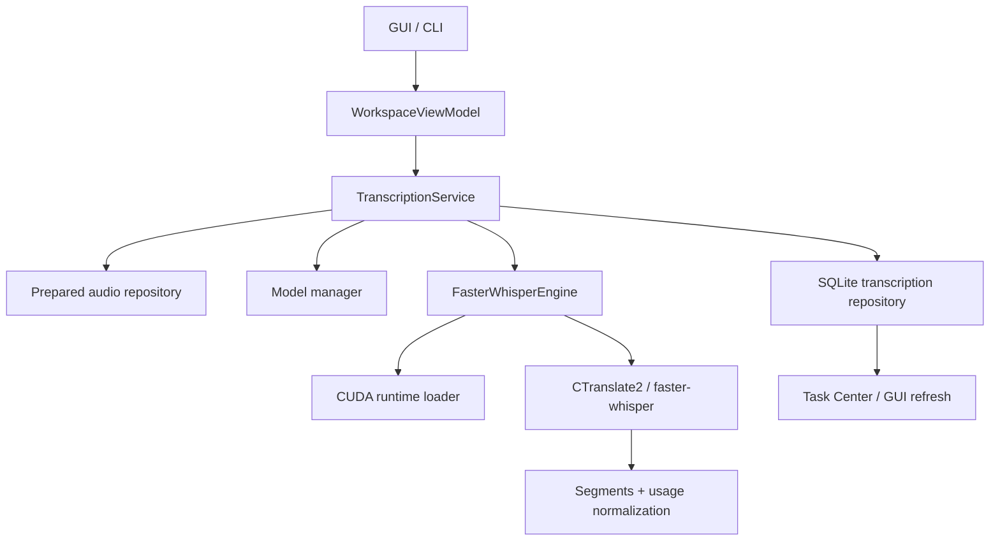

# Component Manager Current Reality Audit

## Scope

This audit records the actual repository state before any v32 implementation work. It focuses on the current local transcription stack, FFmpeg, hardware detection, UI entry points, storage, cancellation, recovery, and the main risks that should be solved by a future Component Manager phase.

## Sources Reviewed

- `pyproject.toml`
- `README.md`
- `docs/PROJECT_BIBLE.md`
- `docs/AI_IMPLEMENTATION_ROADMAP.md`
- `docs/LOCAL_COMPONENTS_AND_TRANSCRIPTION.md`
- `docs/CURRENT_IMPLEMENTATION_REALITY.md`
- `docs/DECISION_REGISTER.md`
- `src/creator_intelligence_studio/application/bootstrap.py`
- `src/creator_intelligence_studio/application/services/transcription_service.py`
- `src/creator_intelligence_studio/application/services/audio_preparation_service.py`
- `src/creator_intelligence_studio/infrastructure/transcription/faster_whisper_engine.py`
- `src/creator_intelligence_studio/infrastructure/transcription/model_manager.py`
- `src/creator_intelligence_studio/infrastructure/transcription/cuda_runtime_loader.py`
- `src/creator_intelligence_studio/infrastructure/transcription/device_detector.py`
- `src/creator_intelligence_studio/infrastructure/audio/ffmpeg_audio_extractor.py`
- `src/creator_intelligence_studio/infrastructure/media/ffmpeg_locator.py`
- `src/creator_intelligence_studio/infrastructure/configuration/settings.py`
- `src/creator_intelligence_studio/shared/paths.py`
- `src/creator_intelligence_studio/presentation/desktop/main_window.py`
- `src/creator_intelligence_studio/presentation/desktop/views/transcription_view.py`
- `src/creator_intelligence_studio/presentation/desktop/views/task_center_view.py`
- `src/creator_intelligence_studio/presentation/desktop/view_models/workspace.py`
- `tests/test_transcription_service.py`
- `tests/test_audio_preparation_service.py`
- `tests/test_bootstrap.py`
- `tests/test_desktop_view_models.py`
- `tests/test_ai_runtime_gui.py`

## Inventory

| Capacidad | Estado | Evidencia | Archivo/clase | Limitaciones |
|---|---|---|---|---|
| Registro de videos | implemented | `CatalogService.register_video` persists local file metadata and current availability. | `CatalogService` | No component lifecycle. |
| Extraccion de audio | implemented | `AudioPreparationService.prepare_audio` uses FFmpeg and persists prepared WAV plus metadata. | `AudioPreparationService` | Uses the current media tool locator; no manager UI. |
| Seleccion de idioma | partially_implemented | `TranscriptionOptions.language` is normalized and passed to `faster-whisper`. | `domain.transcription.services` | Auto language is `None`; no language benchmark. |
| Seleccion de modelo | implemented | `PROFILE_TO_MODEL` maps fast/balanced/quality to base/small/medium and the view exposes model selection. | `domain.transcription.services`, `TranscriptionView` | Only the built-in model trio is curable today. |
| Descarga de modelo | implemented | `TranscriptionModelManager.download_model` uses `huggingface_hub.snapshot_download` with atomic staging. | `TranscriptionModelManager` | Hidden network download if cache is missing. |
| Carga de modelo | implemented | `FasterWhisperEngine._load_model` loads `WhisperModel(download_root=...)`. | `FasterWhisperEngine` | Singleton-like reuse only inside the engine instance. |
| Seleccion CPU/GPU | partially_implemented | `verify_backend` inspects NVIDIA runtime DLLs, `ctranslate2` device count, and supported compute types. | `FasterWhisperEngine.verify_backend` | It is environment capability probing, not a functional benchmark. |
| Compute type | implemented | `plan_runtime` normalizes `int8`, `int8_float16`, `float16`, `default`, `auto`. | `FasterWhisperEngine.plan_runtime` | GPU path still depends on backend availability. |
| Word timestamps | implemented | `options.word_timestamps` is passed to `model.transcribe` and stored in results. | `FasterWhisperEngine.transcribe` | No separate certification flow. |
| Segment timestamps | implemented | Segment start/end are persisted in `transcription_segments`. | `SQLiteTranscriptionRepository`, `TranscriptionSegment` | Not a separate capability gate. |
| VAD | implemented | `vad_filter` is passed through to the engine. | `TranscriptionOptions`, `FasterWhisperEngine.transcribe` | No dedicated UI explanation of the tradeoff. |
| Progreso | partially_implemented | Progress callbacks exist from view to service to engine and download manager. | `TranscriptionView`, `TranscriptionService`, `model_manager` | Approximate progress only; no ETA contract. |
| Cancelacion | partially_implemented | `cancel_transcription` sets a threading event; engine checks it cooperatively. | `TranscriptionService`, `FakeBackendEngine` tests | Does not hard-kill subprocesses inside inference. |
| Persistencia | implemented | Transcription and segment rows are written via SQLite upsert. | `SQLiteTranscriptionRepository` | Single-row overwrite by `video_asset_id`. |
| Reutilizacion de resultados | implemented | Completed transcription is reused when the source and config fingerprints match. | `TranscriptionService._transcription_is_stale` | Reuse depends on exact fingerprint match. |
| Hash del archivo | implemented | Source audio fingerprint includes file size, modification time, selected stream, and cache metadata. | `build_source_audio_fingerprint` | It is a semantic fingerprint, not a cryptographic hash of the media file content. |
| Reintento | partially_implemented | UI and service support retries by rerunning the pipeline or transcribing again. | `WorkspaceViewModel`, `TaskCenterView` | No dedicated resumable transcription job state. |
| Recuperacion tras reinicio | partially_implemented | UI state store can recover AI runtime task display; transcription itself is not rehydrated as a first-class resume queue. | `WorkspaceViewModel._recover_ai_runtime_state`, `WorkspaceUiStateStore` | Orphaned local transcription jobs are not a formal component manager concept. |
| Limpieza de temporales | partially_implemented | FFmpeg temp WAVs are removed on error/timeout; prepared audio uses controlled cache paths and cleanup helpers. | `ffmpeg_audio_extractor.py`, `audio_preparation_service.py` | Cache cleanup is manual or service-driven, not component-managed. |
| Mensajes de error | implemented | Domain/service errors are normalized to Spanish safe messages in the UI. | `error_mapping.py`, views | No dedicated component manager UX yet. |
| GUI | implemented | There is a dedicated `TranscriptionView` plus task center and settings. | `main_window.py`, `transcription_view.py`, `task_center_view.py` | UI is functional but not a future onboarding flow. |
| CLI | implemented | CLI routes transcription commands through the same service layer. | `presentation/cli/cli.py` | No component manager CLI yet. |
| Tests | implemented | Focused tests cover service, audio prep, GUI launch, and workspace. | `tests/test_transcription_service.py`, `tests/test_audio_preparation_service.py` | No strict component catalog tests exist yet. |
| Benchmark | not_started | No runtime benchmark gate exists for local transcription. | repo search | Hardware claims are not benchmarked. |
| Confidence / suspicious segments | partially_implemented | Backend and model verification return notes/errors, but confidence is not a capability contract. | `TranscriptionBackendInfo`, `TranscriptionModelInfo` | No formal certification status. |

## Real Flow

### Jump Map

| Step | Function / class | Input | Output | Errors / side effects |
|---|---|---|---|---|
| GUI/CLI to view model | `TranscriptionView`, `WorkspaceViewModel.transcribe_video` | video id, transcription options | thread start, progress callback | Qt thread, UI state changes |
| View model to service | `TranscriptionService.transcribe_video` | video id, options | `TranscriptionReport` | persists queued/loading/completed or terminal error rows |
| Audio prep lookup | `PreparedAudioRepository.get_by_video_asset_id` | video id | prepared audio row | raises state errors if missing/incomplete |
| Model status | `TranscriptionModelManager.get_model_status` | model name | `TranscriptionModelInfo` | cache inspection only |
| Download on demand | `TranscriptionModelManager.download_model` | model name | installed model info or error info | hidden HF network download if not installed |
| Backend verify | `FasterWhisperEngine.verify_backend` | none | `TranscriptionBackendInfo` | may register DLL dirs on Windows |
| Inference | `FasterWhisperEngine.transcribe` | audio path, options | `TranscriptionResult` | cooperative cancellation only |
| Persistence | `SQLiteTranscriptionRepository.upsert` | transcription + segments | reloaded transcription row | one row per video asset |
| Task Center | `TaskCenterView` | persisted background task | visible task state | cancellation button maps to service cancel |

## FFmpeg Reality

| Question | Reality |
|---|---|
| How is FFmpeg found? | `MediaToolLocator` checks configured paths, env vars, PATH, portable `tools/ffmpeg/bin`, then common Windows locations. |
| Does it depend on PATH? | No, PATH is one candidate among several. |
| Is there a configured path? | Yes, via `AppSettings.ffmpeg_path`, `ffprobe_path`, and `ffmpeg_bin_directory`. |
| Is a bundled binary included? | No bundled binary is committed; portable lookup is supported. |
| Is version verified? | Yes, by running `ffmpeg -version` or `ffprobe -version`. |
| Is ffprobe used? | Yes, for media inspection. |
| Are commands passed safely? | Yes, `subprocess.run` uses argument lists, not `shell=True`. |
| What happens on error? | Errors become `tool_unavailable` or `FFmpegAudioExtractionError` with safe text. |
| Temp files? | A temp WAV with `.tmp` suffix is created and removed on error. |

## Engine Reality

| Topic | Reality |
|---|---|
| Engine | `faster-whisper` via `CTranslate2`. |
| Default models | `base`, `small`, `medium`. |
| Default profile mapping | `fast -> base`, `balanced -> small`, `quality -> medium`. |
| Download root | `models/transcription/faster-whisper/<model>`. |
| Network download | Uses Hugging Face snapshot download if model is missing. |
| CUDA detection | Runtime DLL discovery + `ctranslate2.get_cuda_device_count()` + `get_supported_compute_types("cuda")`. |
| Fallback | CPU fallback exists when `device="auto"` and CUDA is not usable. |
| Cancellation | Cooperative token checked during segment iteration and model download. |
| Thread safety | Model reuse is scoped to the engine instance; active job cancellation is guarded by a lock in the service. |

## Paths And Storage

| Area | Current behavior |
|---|---|
| Data directory | Configurable, resolved relative to project root if not absolute. |
| Logs directory | Configurable and created on bootstrap. |
| Models directory | Configurable and used for model cache. |
| Artifacts directory | Configurable and created on bootstrap. |
| Prepared audio cache | Stored under `cache/videos/<video-id>/audio/`. |
| Transcription exports | Stored under `cache/transcriptions/<video-id>/`. |
| Temporary download staging | Stored under `models/transcription/faster-whisper/.downloads/`. |
| MP4 retention | The original file is not copied permanently by default. |

## Current Risks

| Risk | Evidence | Severity | Probability | Mitigation target | Phase |
|---|---|---:|---:|---|---|
| Hidden model download on first transcribe | `snapshot_download` is called when the model is not installed. | high | medium | explicit install manager and offline-safe onboarding | v32 |
| GPU detected but not functionally ready | `nvidia-smi` and runtime DLL discovery are advisory; not a benchmark. | high | medium | runtime check + benchmark | v32 |
| PATH dependence for ffmpeg/ffprobe fallback | locator scans PATH after settings/env. | medium | medium | managed component install path | v32 |
| Cancellation is cooperative only | engine checks token between segments. | medium | medium | define cancel semantics in manager docs | v32 |
| No formal resumable download contract | staging exists, but pause/resume metadata is not a first-class state machine. | high | high | download manager with partial state | v32 |
| No dedicated component catalog | current model list is just local cache state. | high | high | signed/versioned component catalog | v32 |
| GUI still exposes raw transcribe controls | current screen is technical, not onboarding-guided. | medium | high | onboarding and local components screen | v32 |

## Reusable Pieces

- `MediaToolLocator` already gives a clean discovery boundary for FFmpeg/ffprobe.
- `TranscriptionService` already separates domain validation, persistence, and engine execution.
- `TranscriptionModelManager` already has atomic staging and cache state inspection.
- `FasterWhisperEngine` already centralizes backend verification and inference.
- `WorkspaceViewModel` already provides a central presentation facade for the GUI.

## Pieces That Should Be Decoupled In v32

- model selection policy from the UI combo box
- download policy from the transcription execution path
- hardware detection from provider-style capability reporting
- cache state from install/download lifecycle
- FFmpeg discovery from transcription logic
- local transcription capability resolution from task execution

## No Direct AI Runtime Coupling

The current transcription stack does not call AI Runtime provider modules directly. The only contact points are:

- `WorkspaceViewModel` hosting both areas in the same presentation facade
- `TaskCenterView` showing AI Runtime diagnostic jobs alongside other task kinds
- shared application bootstrap and shared persistence infrastructure

There is no code path where AI Runtime request builders are reused for local transcription.
