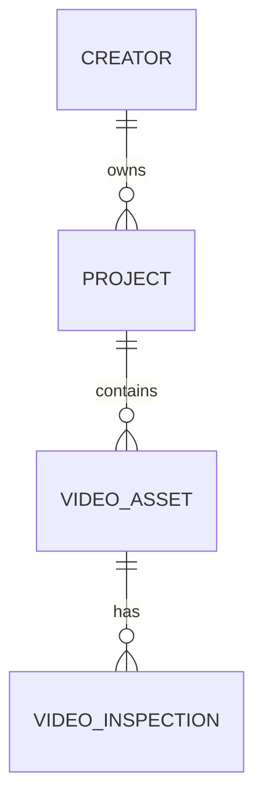

# Data Model - Creator Intelligence Studio

## Principios

- Cada creador tiene aislamiento logico.
- Cada proyecto pertenece a un creador.
- Cada video y cada artefacto derivado son rastreables.
- Cada analisis debe conservar version, origen y configuracion.
- Los datos calculados deben diferenciarse de los observables.

## Identificadores

- Identificadores internos: UUID recomendado.
- Los objetos persistidos deben tener `id` estable.
- Los artefactos y modelos deben incluir `version`.
- Las relaciones deben ser explicitas y no implicitas.

## Esquema inicial implementado

### `schema_migrations`

- `version` entero.
- `name` texto.
- `applied_at` UTC.

### `creators`

- `id` UUID string.
- `display_name`.
- `slug` unico.
- `description` opcional.
- `created_at` UTC.
- `updated_at` UTC.
- `status` con valores `active` o `archived`.

### `projects`

- `id` UUID string.
- `creator_id` FK a `creators.id`.
- `name`.
- `description` opcional.
- `project_type` con valores `long_form`, `short_form`, `mixed`, `research`.
- `status` con valores `active`, `completed`, `archived`.
- `created_at` UTC.
- `updated_at` UTC.

### `video_assets`

- `id` UUID string.
- `project_id` FK a `projects.id`.
- `title`.
- `source_path` absoluta normalizada.
- `original_filename`.
- `extension`.
- `file_size_bytes`.
- `file_modified_at` UTC opcional.
- `source_type` con valores `local_file`, `platform_import`, `manual_reference`.
- `processing_status` con valores `registered`, `queued`, `processing`, `completed`, `failed`, `cancelled`.
- `registered_at` UTC.
- `updated_at` UTC.
- `notes` opcional.
- `file_available` booleano calculado o actualizado.

### `video_inspections`

- `id` UUID string.
- `video_asset_id` FK unica a `video_assets.id`.
- `inspection_status` con valores `not_inspected`, `queued`, `inspecting`, `completed`, `failed`, `file_missing`, `tool_unavailable`, `stale`.
- `inspected_at` UTC.
- `source_file_size_bytes`.
- `source_file_modified_at` UTC.
- `duration_seconds`.
- `format_name`.
- `format_long_name`.
- `overall_bitrate`.
- `stream_count`.
- `video_stream_count`.
- `audio_stream_count`.
- `subtitle_stream_count`.
- `width`.
- `height`.
- `display_aspect_ratio`.
- `pixel_aspect_ratio`.
- `frame_rate_numerator` y `frame_rate_denominator`.
- `average_frame_rate_numerator` y `average_frame_rate_denominator`.
- `video_codec`.
- `video_codec_profile`.
- `pixel_format`.
- `video_bitrate`.
- `audio_codec`.
- `audio_sample_rate`.
- `audio_channels`.
- `audio_channel_layout`.
- `audio_bitrate`.
- `rotation_degrees`.
- `metadata_json` con el JSON normalizado de `ffprobe`.
- `ffprobe_version` y `ffprobe_path`.
- `ffmpeg_version` y `ffmpeg_path`.
- `thumbnail_relative_path`.
- `error_code` y `error_message`.
- `created_at` y `updated_at` UTC.

## Relaciones

## Estado y vigencia

- `video_assets.processing_status` describe el flujo de registro.
- `video_inspections.inspection_status` describe el resultado tecnico persistido.
- Un resultado puede ser `stale` si el archivo cambia despues de inspeccion.
- `file_missing` indica que el archivo ya no esta disponible.
- `tool_unavailable` indica que `ffprobe` no estaba disponible para completar la fase.

## Artefactos

Los artefactos minimos contemplados son:

- original;
- hash futuro;
- proxy;
- audio;
- inspeccion tecnica;
- miniatura tecnica;
- segmentos;
- escenas;
- fotogramas clave;
- eventos acusticos;
- analisis;
- recomendaciones;
- feedback;
- historial;
- costos;
- tiempos.

## Pendientes

- formato fisico exacto de persistencia para artefactos grandes;
- estrategia final de rutas portables;
- versionado adicional de inspeccion y miniaturas.
