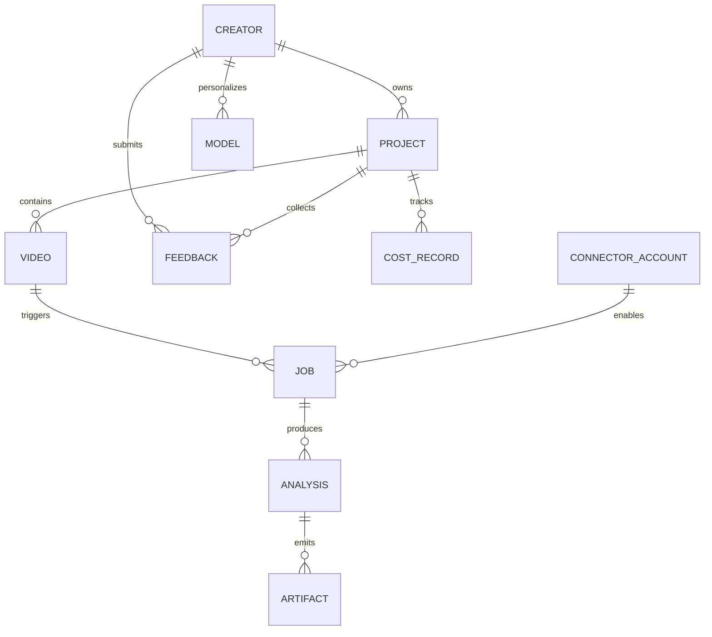

# Data Model - Creator Intelligence Studio

## Principios

- Cada creador tiene aislamiento lógico.
- Cada proyecto pertenece a un creador.
- Cada video y cada artefacto derivado son rastreables.
- Cada análisis debe conservar versión, origen y configuración.
- Los datos calculados deben diferenciarse de los observables.

## Identificadores

- Identificadores internos: UUID recomendado.
- Los objetos persistidos deben tener `id` estable.
- Los artefactos y modelos deben incluir `version`.
- Las relaciones deben ser explícitas y no implícitas.

## Entidades principales

### Creator

- identidad del creador;
- preferencias;
- perfil lingüístico;
- benchmarks personales;
- configuración de privacidad;
- rutas y espacio de trabajo.

### Project

- pertenece a un creador;
- agrupa videos, jobs, análisis y feedback;
- define configuración de procesamiento.

### MediaAsset

- video original;
- proxy;
- audio extraído;
- fotogramas;
- miniaturas;
- exportaciones.

### Video

- referencia al archivo original;
- hash;
- duración;
- formato;
- estado de importación;
- vínculo con proyecto.

### Job

- tipo;
- estado;
- prioridad;
- progreso;
- errores;
- timestamps;
- resultados intermedios.

### Analysis

- tipo de análisis;
- fuente;
- versión del pipeline;
- métricas;
- inferencias;
- timestamps;
- confianza.

### Artifact

- transcripción;
- segmentos;
- escenas;
- embeddings;
- eventos;
- recomendaciones;
- reportes;
- salidas del proveedor.

### Model

- nombre;
- versión;
- backend;
- métricas;
- compatibilidad;
- estado;
- ubicación.

### Feedback

- aprobaciones;
- rechazos;
- correcciones;
- comentarios;
- señal de entrenamiento;
- vínculo con resultado o modelo.

### ConnectorAccount

- proveedor;
- ámbito;
- credenciales;
- estado;
- permisos;
- sincronización.

### CostRecord

- tarea;
- proveedor;
- unidad de costo;
- presupuesto;
- consumo;
- decisión de ejecución;
- timestamps.

## Relaciones

## Estados

### Job

- `queued`
- `running`
- `paused`
- `cancelled`
- `failed`
- `completed`

### Analysis

- `draft`
- `partial`
- `final`
- `stale`
- `superseded`

### Model

- `registered`
- `candidate`
- `validated`
- `deprecated`
- `blocked`

## Versionado

- Cada pipeline debe registrar su versión.
- Cada modelo debe registrar su versión.
- Cada resultado debe recordar con qué versión fue generado.
- Las revisiones del usuario crean nueva evidencia sin borrar la anterior.

## Artefactos

Los artefactos mínimos contemplados son:

- original;
- hash;
- proxy;
- audio;
- transcripción;
- segmentos;
- escenas;
- fotogramas clave;
- eventos acústicos;
- características visuales;
- embeddings;
- análisis;
- recomendaciones;
- feedback;
- historial;
- costos;
- tiempos.

## Persistencia recomendada

- metadatos estructurados;
- archivos para binarios pesados;
- índice local para búsqueda;
- manifiestos por proyecto y modelo.

## Esquema inicial implementado

La base SQLite inicial del MVP guarda cuatro tablas estructurales:

- `schema_migrations`
- `creators`
- `projects`
- `video_assets`

### `creators`

- `id` UUID string.
- `display_name`.
- `slug` único.
- `description` opcional.
- `created_at` UTC.
- `updated_at` UTC.
- `status` con valores `active` o `archived`.

### `projects`

- `id` UUID string.
- `creator_id` FK a `creators.id`.
- `name`.
- `description` opcional.
- `project_type` con valores `long_form`, `short_form`, `mixed`, `research`.
- `status` con valores `active`, `completed`, `archived`.
- `created_at` UTC.
- `updated_at` UTC.

### `video_assets`

- `id` UUID string.
- `project_id` FK a `projects.id`.
- `title`.
- `source_path` absoluta normalizada.
- `original_filename`.
- `extension`.
- `file_size_bytes`.
- `file_modified_at` UTC opcional.
- `source_type` con valores `local_file`, `platform_import`, `manual_reference`.
- `processing_status` con valores `registered`, `queued`, `processing`, `completed`, `failed`, `cancelled`.
- `registered_at` UTC.
- `updated_at` UTC.
- `notes` opcional.
- `file_available` booleano calculado o actualizado.

## Pendientes

- formato físico exacto de persistencia;
- motor concreto de almacenamiento;
- estrategia final de migraciones.
