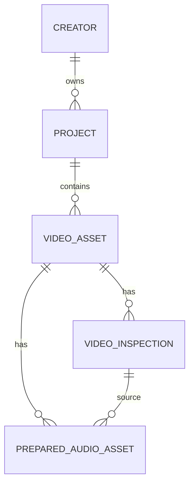

# Data Model - Creator Intelligence Studio

## Principios

- Cada creador tiene aislamiento logico.
- Cada proyecto pertenece a un creador.
- Cada video y cada artefacto derivado son rastreables.
- Cada analisis debe conservar version, origen y configuracion.
- Los datos calculados deben diferenciarse de los observables.

## Identificadores

- Identificadores internos: UUID recomendado.
- Los objetos persistidos deben tener `id` estable.
- Los artefactos y modelos deben incluir `version`.
- Las relaciones deben ser explicitas y no implicitas.

## Esquema implementado

### `schema_migrations`

- `version` entero.
- `name` texto.
- `applied_at` UTC.

### `creators`

- `id` UUID string.
- `display_name`.
- `slug` unico.
- `description` opcional.
- `created_at` UTC.
- `updated_at` UTC.
- `status` con valores `active` o `archived`.

### `projects`

- `id` UUID string.
- `creator_id` FK a `creators.id`.
- `name`.
- `description` opcional.
- `project_type` con valores `long_form`, `short_form`, `mixed`, `research`.
- `status` con valores `active`, `completed`, `archived`.
- `created_at` UTC.
- `updated_at` UTC.

### `video_assets`

- `id` UUID string.
- `project_id` FK a `projects.id`.
- `title`.
- `source_path` absoluta normalizada.
- `original_filename`.
- `extension`.
- `file_size_bytes`.
- `file_modified_at` UTC opcional.
- `source_type` con valores `local_file`, `platform_import`, `manual_reference`.
- `processing_status` con valores `registered`, `queued`, `processing`, `completed`, `failed`, `cancelled`.
- `registered_at` UTC.
- `updated_at` UTC.
- `notes` opcional.
- `file_available` booleano calculado o actualizado.

### `video_inspections`

- `id` UUID string.
- `video_asset_id` FK unica a `video_assets.id`.
- `inspection_status` con valores `not_inspected`, `queued`, `inspecting`, `completed`, `failed`, `file_missing`, `tool_unavailable`, `stale`.
- `inspected_at` UTC.
- `source_file_size_bytes`.
- `source_file_modified_at` UTC.
- `duration_seconds`.
- `format_name`.
- `format_long_name`.
- `overall_bitrate`.
- `stream_count`.
- `video_stream_count`.
- `audio_stream_count`.
- `subtitle_stream_count`.
- `width`.
- `height`.
- `display_aspect_ratio`.
- `pixel_aspect_ratio`.
- `frame_rate_numerator` y `frame_rate_denominator`.
- `average_frame_rate_numerator` y `average_frame_rate_denominator`.
- `video_codec`.
- `video_codec_profile`.
- `pixel_format`.
- `video_bitrate`.
- `audio_codec`.
- `audio_sample_rate`.
- `audio_channels`.
- `audio_channel_layout`.
- `audio_bitrate`.
- `rotation_degrees`.
- `metadata_json` con el JSON normalizado de `ffprobe`.
- `ffprobe_version` y `ffprobe_path`.
- `ffmpeg_version` y `ffmpeg_path`.
- `thumbnail_relative_path`.
- `error_code` y `error_message`.
- `created_at` y `updated_at` UTC.

### `prepared_audio_assets`

- `id` UUID string.
- `video_asset_id` FK unica a `video_assets.id`.
- `source_inspection_id` FK a `video_inspections.id`.
- `status` con valores `not_prepared`, `queued`, `extracting`, `completed`, `failed`, `file_missing`, `no_audio_stream`, `tool_unavailable`, `stale`.
- `relative_cache_path` relativo a `cache/`.
- `metadata_relative_path` relativo a `cache/`.
- `format_name`.
- `codec_name`.
- `sample_rate_hz`.
- `channels`.
- `channel_layout`.
- `bit_depth`.
- `duration_seconds`.
- `file_size_bytes`.
- `source_file_size_bytes`.
- `source_file_modified_at` UTC.

## YouTube read-only integration

La fase v21 agrega entidades locales para conexiones OAuth de escritorio, canales remotos, videos remotos, miniaturas remotas, sincronizaciones, items de sincronizacion, importes de metricas, enlaces de contenido, uso de cuota y programaciones de sincronizacion.

Tablas principales:

- `youtube_connections`
- `youtube_channels`
- `youtube_remote_videos`
- `youtube_video_thumbnails`
- `youtube_sync_runs`
- `youtube_sync_items`
- `youtube_metric_imports`
- `youtube_metric_values`
- `youtube_content_links`
- `youtube_quota_usage`
- `youtube_sync_schedules`

La base local solo conserva referencias, fingerprints, estados y metadatos necesarios para trazabilidad. Los tokens no se guardan en texto plano en la base principal.
- `selected_stream_index`.
- `selected_stream_codec_name`.
- `selected_stream_channels`.
- `selected_stream_channel_layout`.
- `selected_stream_sample_rate_hz`.
- `selected_stream_language`.
- `selected_stream_is_default`.
- `extraction_started_at` UTC.
- `extraction_completed_at` UTC.
- `ffmpeg_version`.
- `cache_version`.
- `normalization_sample_rate_hz`.
- `normalization_channels`.
- `warning_code` y `warning_message`.
- `error_code` y `error_message`.
- `created_at` y `updated_at` UTC.

### `packaging_assets` y tablas asociadas

- `packaging_assets` para agrupar titulos, miniaturas, pares, conceptos y prompts por creador y publicacion o video.
- `title_versions` y `thumbnail_versions` para conservar versiones inmutables.
- `packaging_reference_assets` y `packaging_brand_profiles` para referencias y perfil de marca derivado.
- `title_analysis_runs`, `thumbnail_analysis_runs`, `packaging_pair_evaluations`, `thumbnail_frame_candidates`, `creative_concepts`, `creative_prompts`, `creative_prompt_references`, `thumbnail_reviews`, `packaging_decisions` y `packaging_experiment_links` para analisis, revision y trazabilidad.

## Relaciones

## Estado y vigencia

- `video_assets.processing_status` describe el flujo de registro.
- `video_inspections.inspection_status` describe el resultado tecnico persistido.
- `prepared_audio_assets.status` describe la preparacion tecnica de audio.
- Un resultado puede ser `stale` si el archivo cambia despues de inspeccion o preparacion.
- `file_missing` indica que el archivo ya no esta disponible.
- `tool_unavailable` indica que `ffprobe` o `ffmpeg` no estaban disponibles para completar la fase.
- `no_audio_stream` indica que no se encontro un stream de audio utilizable.

## Artefactos

Los artefactos minimos contemplados son:

- original;
- hash futuro;
- proxy;
- audio;
- inspeccion tecnica;
- miniatura tecnica;
- segmentos;
- escenas;
- fotogramas clave;
- eventos acusticos;
- analisis;
- recomendaciones;
- feedback;
- historial;
- costos;
- tiempos.

## Migracion v3

- agrega `prepared_audio_assets`;
- conserva la compatibilidad con `creators`, `projects`, `video_assets` y `video_inspections`;
- no modifica IDs existentes;
- mantiene indices utiles por `video_asset_id`, `source_inspection_id` y `status`.

## Migracion v12: Clip rendering

La migracion v12 agrega:

- `clip_render_jobs`
- `clip_render_artifacts`
- `clip_render_events`
- `clip_render_batches`
- `clip_render_batch_items`

Estos registros conservan la trazabilidad de la salida local, su verificacion y el historial de batch sin tocar el archivo fuente.

## Migration v13: Subtitles

La migracion v13 agrega:

- `subtitle_tracks`
- `subtitle_cues`
- `subtitle_edit_events`
- `subtitle_exports`

Campos principales:

- `video_asset_id`
- `transcription_id`
- `ranked_clip_candidate_id`
- `render_job_id`
- `language`
- `name`
- `status`
- `source_type`
- `track_version`
- `configuration_fingerprint`
- `source_fingerprint`
- `source_start_seconds`
- `source_end_seconds`
- `cue_count`
- `total_text_length`
- `is_default`
- `is_locked`
- `warning_code`
- `warning_message`
- `error_code`
- `error_message`
- `completed_at`
- `cue_index`
- `start_seconds`
- `end_seconds`
- `text`
- `original_text`
- `source_segment_ids_json`
- `speaker_label`
- `line_count`
- `character_count`
- `characters_per_second`
- `words_per_minute`
- `validation_status`
- `warning_codes_json`
- `action`
- `previous_json`
- `new_json`
- `note`
- `format`
- `output_path`
- `fingerprint`
- `size_bytes`
- `verified_at`

`subtitle_tracks` conserva tracks versionados y enlaza cada pista con su transcripcion origen y, cuando aplica, con un candidato de clip o un render job. `subtitle_cues` conserva cues ordenados de forma estable. `subtitle_edit_events` registra ediciones y restauraciones sin sobrescribir el historial previo. `subtitle_exports` conserva exportaciones verificadas y su fingerprint. La migracion v14 agrega `clip_render_deliveries` y `clip_render_delivery_artifacts` para sidecar y burn-in sin alterar el render historico.

La capa de subtitulos mantiene separada la transcripcion original del texto editorial, soporta tracks de video completo o de clip, y no convierte las preferencias de segmentacion en una reescritura automatica de contenido.

## Pendientes

- formato fisico final de persistencia para artefactos grandes;
- estrategia final de rutas portables;
- versionado adicional de inspeccion, audio y miniaturas.

## Migration v4: Transcription

La migracion v4 agrega:

- `transcriptions`
- `transcription_segments`

Campos principales:

- `video_asset_id`
- `prepared_audio_asset_id`
- `status`
- `engine`
- `model_name`
- `device`
- `compute_type`
- `requested_language`
- `detected_language`
- `full_text`
- `duration_seconds`
- `processing_time_seconds`
- `real_time_factor`
- `segment_count`
- `source_audio_fingerprint`
- `configuration_fingerprint`

`transcription_segments` conserva `segment_index` con orden estable y FK hacia `transcriptions`.

## Migration v5: Acoustic analysis

La migracion v5 agrega:

- `acoustic_analyses`
- `acoustic_timeline_windows`
- `acoustic_events`

Campos principales:

- `video_asset_id`
- `prepared_audio_asset_id`
- `transcription_id`
- `status`
- `analyzer_version`
- `configuration_fingerprint`
- `source_audio_fingerprint`
- `duration_seconds`
- `speech_duration_seconds`
- `silence_duration_seconds`
- `speech_ratio`
- `silence_ratio`
- `words_per_minute`
- `voiced_words_per_minute`
- `average_energy`
- `peak_energy`
- `dynamic_range`
- `pause_count`
- `average_pause_seconds`
- `longest_pause_seconds`
- `short_pause_count`
- `medium_pause_count`
- `long_pause_count`
- `low_activity_segment_count`
- `abrupt_change_count`
- `event_candidate_count`

`acoustic_timeline_windows` conserva `window_index` con orden estable y FK hacia `acoustic_analyses`.
`acoustic_events` conserva `event_index` con orden estable y FK hacia `acoustic_analyses`.

## Migration v6: Visual analysis

La migracion v6 agrega:

- `visual_analyses`
- `visual_timeline_windows`
- `visual_scenes`
- `visual_events`

Campos principales:

- `video_asset_id`
- `source_inspection_id`
- `status`
- `analyzer_version`
- `configuration_fingerprint`
- `source_file_size_bytes`
- `source_file_modified_at`
- `duration_seconds`
- `sampled_frame_count`
- `detected_cut_count`
- `detected_scene_count`
- `keyframe_count`
- `static_segment_count`
- `black_frame_event_count`
- `freeze_event_count`
- `average_brightness`
- `brightness_variation`
- `average_contrast`
- `average_motion`
- `peak_motion`

`visual_timeline_windows` conserva `window_index` con orden estable y FK hacia `visual_analyses`.
`visual_scenes` conserva `scene_index` con orden estable, FK hacia `visual_analyses` y una ruta relativa al keyframe representativo.
`visual_events` conserva `event_index` con orden estable y FK hacia `visual_analyses`.

La vigencia del analisis visual depende del archivo fuente, la inspeccion tecnica de origen, el fingerprint de configuracion, la version del analizador y la disponibilidad de keyframes generados en cache controlada.

La vigencia se define por fingerprints de entrada, configuracion, version del analizador y cambios en el audio preparado.

## Migration v7: Multimodal analysis

La migracion v7 agrega:

- `multimodal_analyses`
- `multimodal_timeline_windows`
- `multimodal_moment_candidates`

Campos principales:

- `video_asset_id`
- `transcription_id`
- `acoustic_analysis_id`
- `visual_analysis_id`
- `status`
- `analyzer_version`
- `configuration_fingerprint`
- `source_fingerprint`
- `duration_seconds`
- `window_size_seconds`
- `window_count`
- `candidate_count`
- `high_activity_candidate_count`
- `transition_candidate_count`
- `silence_candidate_count`
- `warning_code`
- `warning_message`
- `error_code`
- `error_message`

`multimodal_timeline_windows` conserva `window_index` con orden estable y FK hacia `multimodal_analyses`.
`multimodal_moment_candidates` conserva `candidate_index` con orden estable y FK hacia `multimodal_analyses`.

La capa multimodal no reemplaza las capas previas: las consume como fuentes y puede operar con cobertura parcial. Guarda fuentes disponibles, fuentes faltantes, evidencia tecnica y candidatos heuristics sin mezclar señal observada con interpretacion narrativa.

## Migration v8: Clip ranking

La migracion v8 agrega:

- `clip_ranking_runs`
- `ranked_clip_candidates`
- `clip_review_events`
- `clip_collections`
- `clip_collection_items`

Campos principales:

- `video_asset_id`
- `multimodal_analysis_id`
- `creator_id`
- `project_id`
- `status`
- `ranker_version`
- `configuration_fingerprint`
- `source_fingerprint`
- `candidate_count`
- `ranked_candidate_count`
- `selected_count`
- `rejected_count`
- `review_count`
- `rank_position`
- `adjusted_start_seconds`
- `adjusted_end_seconds`
- `duration_seconds`
- `candidate_type`
- `source_score`
- `source_confidence`
- `rank_score`
- `quality_score`
- `diversity_score`
- `overlap_penalty`
- `duration_score`
- `opening_score`
- `closing_score`
- `speech_score`
- `visual_score`
- `acoustic_score`
- `transition_score`
- `novelty_score`
- `evidence_strength_score`
- `review_status`
- `user_rating`
- `user_note`
- `tags_json`
- `explanation_json`

`ranked_clip_candidates` conserva `rank_position` con orden estable y FK hacia `clip_ranking_runs` y `multimodal_moment_candidates`.
`clip_review_events` conserva `event_index` con orden estable y FK hacia `ranked_clip_candidates`.
`clip_collection_items` conserva `item_index` con orden estable y FK hacia `clip_collections` y `ranked_clip_candidates`.

El ranker y la revision humana no eliminan el candidato original; registran decisiones, ajustes y exportaciones como historial estructurado.

## Migration v9: Personalization data

La migracion v9 agrega:

- `creator_dataset_snapshots`
- `creator_dataset_examples`
- `creator_dataset_conflicts`
- `creator_dataset_quality_reports`
- `creator_feature_schemas`

Campos principales:

- `creator_id`
- `project_id`
- `name`
- `status`
- `dataset_version`
- `feature_schema_version`
- `label_schema_version`
- `source_fingerprint`
- `configuration_fingerprint`
- `example_count`
- `positive_count`
- `negative_count`
- `neutral_count`
- `excluded_count`
- `conflict_count`
- `train_count`
- `validation_count`
- `test_count`
- `readiness_status`
- `readiness_score`
- `ranking_run_id`
- `ranked_clip_candidate_id`
- `multimodal_candidate_id`
- `group_key`
- `label`
- `label_source`
- `label_confidence`
- `human_review_status`
- `human_rating`
- `human_tags_json`
- `feature_vector_json`
- `feature_schema_version`
- `quality_flags_json`
- `exclusion_reason`
- `split_name`
- `sample_weight`
- `conflict_type`
- `candidate_a_id`
- `candidate_b_id`
- `duplicate_ratio`
- `overlap_ratio`
- `missing_feature_ratio`
- `class_balance_score`
- `creator_coverage_score`
- `temporal_coverage_score`
- `source_diversity_score`
- `label_consistency_score`
- `leakage_risk_score`
- `recommendations_json`

`creator_dataset_snapshots` conserva una version inmutable por creador y, cuando aplica, por proyecto. `creator_dataset_examples` conserva un ejemplo reproducible por fila con split, label y features con nombre estable. `creator_dataset_conflicts` registra conflictos y resoluciones sin borrar evidencia. `creator_dataset_quality_reports` conserva la evaluacion de calidad y readiness. `creator_feature_schemas` versiona el esquema de features para comparar snapshots futuros.

La capa de personalizacion mantiene aislamiento por creador, evita fuga de informacion entre train, validation y test, y no convierte el feedback en entrenamiento automatico. Las exportaciones por defecto no incluyen texto completo ni notas privadas.

## Migration v10

La migracion v10 agrega:

- `personalization_training_runs`
- `personalization_model_metrics`
- `personalization_model_predictions`
- `personalization_model_registry`
- `personalization_model_comparisons`

Estos objetos registran:

- entrenamiento baseline por creador;
- metricas por split;
- predicciones para auditoria;
- activacion, desactivacion y retiro del modelo;
- comparacion contra baselines y otras corridas.

## Personalization models

La capa de modelos personalizada usa artefactos locales en `models/personalization/<creator-id>/<training-run-id>/` y no carga artefactos arbitrarios.

Los registros conservan:

- feature_schema_version;
- label_schema_version;
- configuration_fingerprint;
- source_fingerprint;
- decision_threshold;
- metricas y predicciones por split;
- estado del modelo registrado.

No se deben mezclar creadores ni usar datos de otro creador como entrenamiento.

## Migration v11

La migracion v11 agrega la auditoria de `operational_evaluation_runs`, `operational_evaluation_stages`, `operational_evaluation_metrics`, `operational_evaluation_assertions` y `operational_evaluation_artifacts`. Estas tablas registran escenarios, tiempos, cache, assertions y artefactos administrados sin tocar las fuentes de usuario.

## Analytics foundation

La fase de analytics manual agrega:

- `analytics_platforms`;
- `analytics_channels`;
- `analytics_publications`;
- `analytics_metric_definitions`;
- `analytics_metric_snapshots`;
- `analytics_imports`;
- `analytics_import_rows`;
- `analytics_field_mappings`.

Puntos clave:

- `platform` y `content_type` son distintos;
- las metricas faltantes no equivalen a cero;
- `raw` y `normalized` se conservan separados;
- los snapshots historicos no se sobrescriben silenciosamente;
- los mappings pueden ser auto o manual y pueden ser por plataforma;
- la trazabilidad mantiene `source_fingerprint`, `source_row_number` y reporte de importacion.
## Migration v17

La migracion v17 agrega:

- `experiment_definitions`
- `experiment_variables`
- `experiment_guardrails`
- `experiment_assignments`
- `recommendation_records`
- `recommendation_decisions`
- `execution_records`
- `experiment_evaluations`
- `experiment_outcomes`
- `learning_records`
- `learning_reviews`
- `experiment_reports`

Estas tablas conservan recomendacion, decision, ejecucion, evaluacion, learning y reporte sin tocar analytics historico ni findings previos.

## Migration v18

La migracion v18 agrega:

- `creator_profiles`
- `creator_traits`
- `creator_trait_evidence`
- `creator_examples`
- `creator_vocabulary`
- `creator_style_rules`
- `creator_style_rule_reviews`
- `creator_limits`
- `creator_profile_snapshots`
- `creator_memory_feedback`

Estas tablas construyen la memoria estructurada del creador con evidencia, contradicciones, revisiones humanas y snapshots versionados sin alterar analytics, experiments ni learning records.

## Migration v19

La migracion v19 agrega:

- `creator_language_corpora`
- `creator_language_corpus_sources`
- `creator_language_analysis_runs`
- `creator_language_metrics`
- `creator_language_patterns`
- `creator_language_pattern_evidence`
- `creator_narrative_profiles`
- `creator_language_candidates`
- `creator_language_profile_snapshots`

Estas tablas conservan corpus seleccionados, fuentes con `text_snapshot`, corridas deterministas, metricas heuristicas, patrones narrativos, evidencia, candidatos revisables y snapshots versionados sin alterar transcripciones, creator memory ni analytics previos.

## Migration v22

La migracion v22 agrega el modelo local de audiencia:

- `audience_profiles`
- `audience_signals`
- `audience_segments`
- `audience_segment_definitions`
- `audience_segment_evidence`
- `audience_affinities`
- `audience_journeys`
- `audience_journey_steps`
- `audience_profile_snapshots`
- `audience_reviews`
- `audience_model_runs`

Estas tablas conservan señales agregadas, segmentos observables, afinidades, journeys, revision humana, snapshots y corridas versionadas por creador, sin PII, sin sobrescribir datos de YouTube y sin alterar Analytics Lab.
## Migration v24: TikTok read-only integration

La migracion v24 agrega tablas creator-scoped para integracion oficial de TikTok en modo solo lectura:

- `tiktok_connections`
- `tiktok_profiles`
- `tiktok_remote_videos`
- `tiktok_video_text_versions`
- `tiktok_cover_versions`
- `tiktok_sync_runs`
- `tiktok_sync_items`
- `tiktok_metric_imports`
- `tiktok_metric_values`
- `tiktok_content_links`
- `tiktok_rate_limit_usage`
- `tiktok_sync_schedules`

La base local conserva solo referencias, scopes concedidos, fingerprints, estados, cursors y timestamps. Los tokens, codes y secrets no se guardan en la base SQLite principal. La migracion es additive, idempotente y no destructiva, y no modifica los datos de YouTube ni Instagram.
## Instagram Read-Only Integration

The Instagram read-only phase adds creator-scoped tables for connections, accounts, remote media, carousel children, caption versions, cover versions, sync runs, sync items, insight imports, insight values, content links, rate limit usage and sync schedules. These tables preserve history, keep tokens out of the main SQLite database and do not overwrite YouTube or manual import data.

## Market and Trend Intelligence Foundation

Market and Trend Intelligence Foundation stores its own sources, observations, trend signals, patterns, fit evaluations, opportunity candidates, reviews, snapshots and reports. It preserves provenance and does not collapse market evidence into a generic metric bucket.
