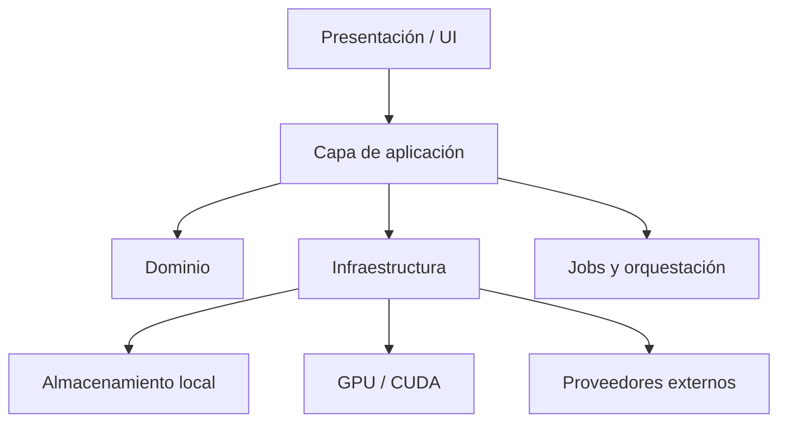

# System Architecture - Creator Intelligence Studio

## Capas

### Presentación

- Pantallas, navegación y estado visual.
- No contiene lógica de negocio pesada.
- Consume casos de uso expuestos por la capa de aplicación.

### Aplicación

- Coordina casos de uso.
- Valida comandos.
- Orquesta jobs, caché, permisos y progresos.
- Traduce entradas de UI en acciones del dominio.

### Dominio

- Entidades, reglas y políticas.
- Cálculos de negocio.
- Contratos de repositorios y proveedores.
- Separación de datos de creador, proyecto y análisis.

### Infraestructura

- Persistencia local.
- Lectura y escritura de archivos.
- Integración con GPU/CUDA.
- Integraciones oficiales con plataformas.
- Proveedores externos opcionales.
- Registro, métricas y telemetría local.

## Módulos

- `Creator Management`
- `Project Management`
- `Media Ingestion`
- `Artifact Store`
- `Job Orchestrator`
- `Analysis Pipeline`
- `Insight Engine`
- `Model Registry`
- `Connector Layer`
- `Cost Control`
- `Diagnostics`

## Flujo de datos

1. El usuario registra o importa un video.
2. El sistema calcula hash y metadatos del origen.
3. Se crea un job con configuración y contexto del creador.
4. El job consulta caché local.
5. Si no hay caché válida, ejecuta la fase necesaria.
6. Cada fase produce artefactos intermedios y resultados finales.
7. El sistema guarda trazabilidad, tiempos, costos y estado.
8. La UI solo consume resultados publicados por la capa de aplicación.

## Jobs

- ingestión;
- extracción de audio;
- transcripción;
- segmentación;
- análisis visual;
- análisis de voz;
- generación de insights;
- ranking de clips;
- sincronización con plataformas;
- entrenamiento o evaluación local cuando aplique.

### Reglas para jobs

- cancelables;
- reintentables con control;
- idempotentes cuando sea posible;
- persistentes;
- observables;
- desacoplados de la UI.

## Almacenamiento

### Local primero

- ruta base configurable;
- separación por creador y proyecto;
- artefactos derivados versionados;
- metadatos estructurados;
- caché por huella y configuración.

### Tipos de persistencia

- archivos binarios para video, audio y proxies;
- archivos estructurados para resultados;
- índices locales para búsqueda y correlación;
- bitácoras para auditoría.

## Proveedores

- Proveedores internos: reglas, ranking, embeddings, caché y evaluadores.
- Proveedores locales de GPU: CUDA.
- Proveedores externos: opcionales y reemplazables.

La arquitectura no debe acoplar toda la lógica a un proveedor concreto.

## CUDA

- CUDA es la ruta principal de aceleración en el MVP.
- Si CUDA está disponible, se prioriza para inferencia y trabajos pesados.
- Si CUDA no está disponible, la aplicación debe abrir y ofrecer diagnóstico y funciones básicas.
- Las tareas pesadas pueden quedar deshabilitadas o degradadas.

## Fallos

### Clases de fallo

- fallo de GPU;
- fallo de IO;
- fallo de red;
- fallo de proveedor externo;
- fallo de datos inválidos;
- fallo de cancelación;
- fallo de caché desactualizada.

### Estrategia

- mensajes claros;
- reintentos limitados;
- degradación segura;
- preservación del estado parcial;
- registro de causa raíz;
- no ocultar fallos como éxito.

## Caché

- por hash del contenido;
- por configuración de pipeline;
- por versión de modelo;
- por creador;
- por versión de extractor.

La caché debe invalidarse cuando cambian entradas, versiones o parámetros relevantes.

## Observabilidad

- logs estructurados;
- progreso por fase;
- trazabilidad de jobs;
- métricas de tiempo y costo;
- diagnóstico de GPU y fallback.

## Evolución futura

- soportar más backends de inferencia;
- ampliar conectores oficiales;
- agregar modelos especializados;
- incorporar entrenamiento incremental;
- mejorar orquestación distribuida si fuera necesario.

## Presentación de escritorio

- `presentation/desktop` concentra la interfaz de escritorio con PySide6.
- La navegación, las vistas y los diálogos dependen de `WorkspaceViewModel`.
- Los widgets no acceden a SQLite directamente.
- La lógica de negocio permanece en `domain/`, `application/` e `infrastructure/`.
- La GUI expone un panel lateral contextual y una barra superior con selección de creador y proyecto.

## Sistema visual

- fondo principal: azul marino muy oscuro;
- paneles: azul grisáceo oscuro;
- superficies secundarias: grafito frío;
- acento principal: azul eléctrico o cian;
- acento de machine learning: violeta;
- éxito: teal;
- advertencias: ámbar;
- errores: rojo;
- texto principal: blanco suave;
- texto secundario: gris azulado claro.

Reglas:

- bordes redondeados moderados;
- separadores finos;
- sombras sutiles;
- tablas profesionales;
- sin lujo visual;
- sin neón excesivo;
- sin imágenes decorativas.
