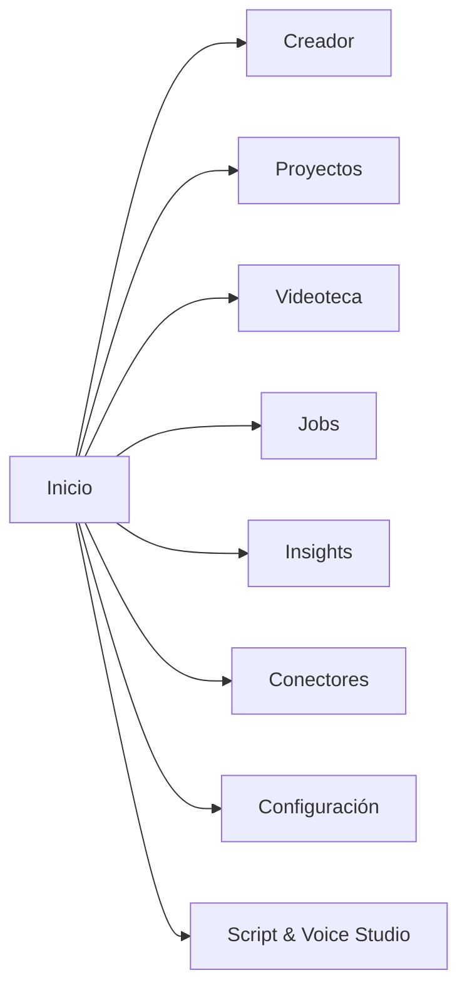

# UI Map - Creator Intelligence Studio

## Navegación principal

## Pantallas

### Inicio

- estado del entorno;
- estado de GPU y fallback;
- accesos rápidos;
- últimos trabajos;
- alertas relevantes.

### Creador

- alta y edición de creador;
- preferencias;
- privacidad;
- benchmarks personales;
- historial resumido.

### Proyectos

- lista de proyectos;
- creación y apertura;
- vista del estado de procesamiento;
- artefactos principales;
- comparación entre versiones.

### Videoteca

- importación de videos;
- registro de fuentes;
- hash y deduplicación;
- estado de ingestión;
- proxies y derivados.

### Jobs

- cola;
- progreso;
- cancelación;
- reintentos;
- errores;
- trazabilidad.

### Insights

- transcripción;
- escenas;
- audio;
- narrativa;
- clips;
- títulos;
- miniaturas;
- rendimiento.

### Conectores

- conexión por proveedor;
- estado de credenciales;
- sincronización;
- límites;
- errores.

### Configuración

- rutas;
- GPU;
- modos local e híbrido;
- presupuestos;
- privacidad;
- diagnóstico.

### Script & Voice Studio

- módulo separado y opcional;
- acceso solo cuando el usuario lo habilita;
- nunca bloquea el uso del resto de la aplicación.

## Funciones por pantalla

- cada pantalla debe mostrar estado vacío;
- cada pantalla debe mostrar progreso;
- cada pantalla debe mostrar errores con causa y acción sugerida;
- cada pantalla debe evitar ocultar fallos como si fueran éxito.

## Estados vacíos

- sin creadores;
- sin proyectos;
- sin videos;
- sin jobs activos;
- sin conexión a un proveedor;
- sin CUDA disponible;
- sin modelos registrados;
- sin feedback todavía.

## Progreso

- barra por job;
- porcentaje por fase;
- tiempo estimado cuando exista suficiente información;
- detalle de fase actual;
- opción de cancelar.

## Errores

- fallo de importación;
- fallo de GPU;
- fallo de proveedor;
- fallo de credenciales;
- fallo de IO;
- fallo de validación;
- fallo de permisos.

Los errores deben explicarse en lenguaje operativo, no como mensajes genéricos.

## Configuración

- configuración global;
- configuración por creador;
- configuración por proyecto;
- configuración por job;
- configuración por proveedor.

## Separación de Script & Voice Studio

- debe aparecer como módulo opcional;
- no debe mezclarse con el flujo base de análisis;
- su activación no debe afectar la navegación principal;
- sus datos, modelos y métricas deben quedar aislados.

## Arquitectura de presentación

- barra lateral izquierda con secciones funcionales y futuras deshabilitadas;
- barra superior con selector de creador, selector de proyecto, búsqueda visual, estado de procesamiento, GPU e indicadores operativos;
- área principal con `QStackedWidget`;
- inspector contextual derecho para detalles y acciones;
- barra inferior compacta para estado operativo.

## Sistema visual

- identidad fría y técnica;
- fondo azul marino muy oscuro;
- paneles azul grisáceo oscuro;
- superficies secundarias grafito frío;
- acento principal azul eléctrico o cian;
- acento ML violeta;
- éxito teal;
- advertencias ámbar;
- errores rojos;
- texto principal blanco suave;
- texto secundario gris azulado claro.

Reglas:

- densidad profesional;
- bordes redondeados moderados;
- separadores finos;
- sombras sutiles;
- tablas legibles;
- sin estética de lujo;
- sin imágenes decorativas.
