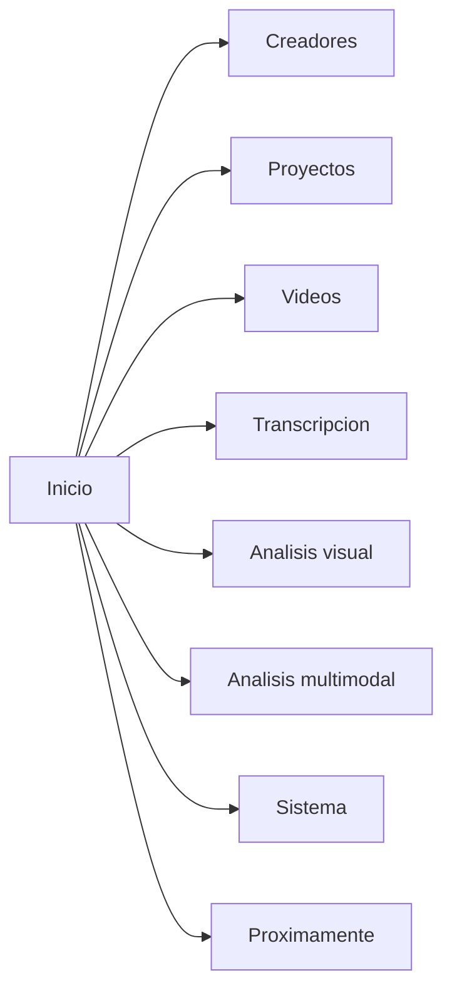

# UI Map - Creator Intelligence Studio

## Navegacion principal

## Pantallas

### Inicio

- estado del entorno;
- estado de GPU y fallback;
- accesos rapidos;
- ultimos trabajos;
- actividad reciente;
- resumen de almacenamiento y herramientas.

### Creadores

- alta y edicion de creador;
- preferencias futuras;
- privacidad futura;
- benchmarks personales futuros;
- historial resumido.

### Proyectos

- lista de proyectos;
- creacion y apertura;
- vista del estado de procesamiento;
- artefactos principales;
- comparacion entre versiones.

### Videos

- registro de videos locales como metadatos;
- lista filtrable por proyecto, estado, disponibilidad y fuente;
- inspector contextual con metadatos tecnicos;
- verificacion de archivo;
- apertura de ubicacion;
- inspeccion tecnica con `ffprobe`;
- miniatura tecnica inicial cuando exista `ffmpeg`;
- preparacion tecnica de audio normalizado con `ffmpeg`;
- inspector de audio preparado con estado, stream seleccionado, formato, sample rate, canales, bit depth y vigencia;
- estado `stale` cuando el archivo cambia tras la inspeccion o la preparacion;
- resumen de transcripcion en el inspector contextual.
- acceso a analisis acustico del video seleccionado.
- acceso a analisis visual del video seleccionado.

### Transcripcion

- selector de perfil rapido / equilibrado / calidad;
- selector de modelo base / small / medium;
- selector de dispositivo auto / cuda / cpu;
- selector de idioma;
- boton de transcribir;
- cancelar;
- exportar TXT, SRT y JSON;
- texto completo;
- tabla de segmentos;
- indicador de progreso aproximado;
- estado de stale.

### Analisis acustico

- estado del analisis;
- duracion de voz y silencio;
- speech ratio;
- palabras por minuto;
- pausas y pausa mas larga;
- energia media y rango dinamico;
- linea temporal tecnica con voz/silencio, energia y eventos candidatos;
- exportar JSON y CSV;
- eliminar analisis;
- reanalizar cuando el audio preparado o la transcripcion cambian.

### Analisis visual

- estado del analisis visual;
- cortes y escenas tecnicas;
- keyframes representativos;
- movimiento medio y pico;
- brillo y contraste relativos;
- segmentos estaticos, posibles frames negros y posibles congelamientos;
- linea temporal visual con eventos candidatos;
- exportacion JSON, CSV de timeline y CSV de escenas;
- stale y regeneracion.

### Analisis multimodal

- estado del analisis y version del analizador;
- fuentes disponibles y fuentes faltantes;
- ventanas sincronizadas entre transcripcion, acustica y vision;
- candidatos tecnicos con score, confidence y evidencia;
- linea temporal unificada;
- orden por tiempo o por score;
- filtros por tipo de candidato;
- exportacion JSON, CSV de timeline, CSV de candidatos y TXT tecnico;
- stale y reanalisis.

### Sistema

- diagnostico del entorno;
- hardware;
- GPU;
- CUDA;
- base local;
- espacio disponible;
- disponibilidad de `ffprobe` y `ffmpeg`.

### Proximamente

- Analisis;
- Clips;
- Miniaturas avanzadas;
- Audiencia;
- Tendencias;
- Script & Voice Studio;
- Modelos.

## Estados vacios

- sin creadores;
- sin proyectos;
- sin videos;
- sin jobs activos;
- sin CUDA disponible;
- sin modelos registrados;
- sin feedback todavia;
- sin inspeccion tecnica aun;
- sin transcripcion aun;
- sin analisis multimodal aun;
- sin herramientas multimedia disponibles.

## Separacion de Script & Voice Studio

- debe aparecer como modulo opcional;
- no debe mezclarse con el flujo base de analisis;
- su activacion no debe afectar la navegacion principal;
- sus datos, modelos y metricas deben quedar aislados.

## Arquitectura de presentacion

- barra lateral izquierda con secciones funcionales y futuras deshabilitadas;
- barra superior con selector de creador, selector de proyecto, busqueda visual, estado de procesamiento, GPU e indicadores operativos;
- area principal con `QStackedWidget`;
- inspector contextual derecho para detalles y acciones;
- barra inferior compacta para estado operativo.

## Sistema visual

- identidad fria y tecnica;
- fondo azul marino muy oscuro;
- paneles azul grisaceo oscuro;
- superficies secundarias grafito frio;
- acento principal azul electrico o cian;
- acento ML violeta;
- exito teal;
- advertencias ambar;
- errores rojos;
- texto principal blanco suave;
- texto secundario gris azulado claro.
