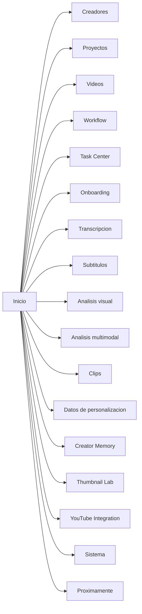

# UI Map - Creator Intelligence Studio

## Navegacion principal

## Pantallas

### Inicio

- creador activo y proyecto activo;
- videos recientes y pendientes de atencion;
- tareas en progreso;
- candidatos pendientes de revision;
- estado de personalizacion;
- errores recientes;
- almacenamiento aproximado;
- accesos rapidos;
- resumen de GPU, CUDA y herramientas.

### Creadores

- alta y edicion de creador;
- preferencias futuras;
- privacidad futura;
- benchmarks personales futuros;
- historial resumido.

### Proyectos

- lista de proyectos;
- creacion y apertura;
- vista del estado de procesamiento;
- artefactos principales;
- comparacion entre versiones.

### Videos

- registro de videos locales como metadatos;
- lista filtrable por proyecto, estado, disponibilidad y fuente;
- inspector contextual con metadatos tecnicos;
- verificacion de archivo;
- apertura de ubicacion;
- inspeccion tecnica con `ffprobe`;
- miniatura tecnica inicial cuando exista `ffmpeg`;
- preparacion tecnica de audio normalizado con `ffmpeg`;
- inspector de audio preparado con estado, stream seleccionado, formato, sample rate, canales, bit depth y vigencia;
- estado `stale` cuando el archivo cambia tras la inspeccion o la preparacion;
- resumen de transcripcion en el inspector contextual.
- acceso a analisis acustico del video seleccionado.
- acceso a analisis visual del video seleccionado.
- acceso a la vista unificada de workflow por video.

### Workflow

- estado agregado por video;
- siguiente accion recomendada;
- progreso aproximado;
- estados de cada etapa con summary, warnings y errores;
- ejecucion del siguiente paso, del grupo de etapas o hasta ranking;
- reintento de etapa fallida;
- reactivacion de etapas stale;
- sin entrenamiento automatico.

### Task Center

- tareas activas y persistidas;
- etapa, video, progreso y tiempo;
- marcar interrumpida;
- reintentar desde el workflow del video;
- continuidad tras cambio de pagina o reapertura.

### Onboarding

- explicacion corta del producto;
- seleccion de almacenamiento;
- verificacion de FFmpeg;
- verificacion de transcripcion;
- creacion del primer creador;
- creacion del primer proyecto;
- importacion del primer video;
- reabrible desde ayuda o barra superior.

### Transcripcion

- selector de perfil rapido / equilibrado / calidad;
- selector de modelo base / small / medium;
- selector de dispositivo auto / cuda / cpu;
- selector de idioma;
- boton de transcribir;
- cancelar;
- exportar TXT, SRT y JSON;
- texto completo;
- tabla de segmentos;
- indicador de progreso aproximado;
- estado de stale.

### Subtitulos

- vista de editor de tracks por video, candidato o render;
- generacion para video completo o clip;
- tabla de cues, historial y validacion;
- importacion y exportacion SRT, VTT, ASS, TXT y JSON;
- preview tecnica por posicion temporal;
- estado stale sin sobrescribir la transcripcion original.

### Analisis acustico

- estado del analisis;
- duracion de voz y silencio;
- speech ratio;
- palabras por minuto;
- pausas y pausa mas larga;
- energia media y rango dinamico;
- linea temporal tecnica con voz/silencio, energia y eventos candidatos;
- exportar JSON y CSV;
- eliminar analisis;
- reanalizar cuando el audio preparado o la transcripcion cambian.

### Analisis visual

- estado del analisis visual;
- cortes y escenas tecnicas;
- keyframes representativos;
- movimiento medio y pico;
- brillo y contraste relativos;
- segmentos estaticos, posibles frames negros y posibles congelamientos;
- linea temporal visual con eventos candidatos;
- exportacion JSON, CSV de timeline y CSV de escenas;
- stale y regeneracion.

### Analisis multimodal

- estado del analisis y version del analizador;
- fuentes disponibles y fuentes faltantes;
- ventanas sincronizadas entre transcripcion, acustica y vision;
- candidatos tecnicos con score, confidence y evidencia;
- linea temporal unificada;
- orden por tiempo o por score;
- filtros por tipo de candidato;
- exportacion JSON, CSV de timeline, CSV de candidatos y TXT tecnico;
- stale y reanalisis.

### Clips

- ranking determinista de candidatos multimodales;
- perfiles balanced, speech-focused, visual-focused, high-energy y story-beats;
- score separado del score multimodal original;
- ajuste manual de bordes;
- aprobacion, rechazo, preseleccion y revision;
- rating humano, notas y tags;
- historial de cambios;
- colecciones locales de clips;
- render local de clips aprobados o seleccionados desde el candidato o la coleccion;
- entregas de subtitulos sidecar o burn-in asociadas al render de clip;
- historial de renders y acceso al output verificado desde Task Center;
- exportacion JSON, CSV y EDL tecnico;
- stale y recalculo sin perder feedback humano.

### Datos de personalizacion

- snapshots por creador y, cuando aplica, por proyecto;
- ejemplo de dataset con label, split, peso y flags de calidad;
- reporte de calidad y readiness;
- comparacion entre snapshots;
- archivado y exportacion JSON, CSV y JSONL;
- aislamiento por creador;
- sin mostrar texto completo ni notas privadas por defecto.

### Creator Memory

- perfil creativo por creador;
- traits, vocabulario, ejemplos y reglas de estilo;
- limites y objetivos editables;
- evidencia, contradicciones y revisiones humanas;
- snapshots versionados y comparacion de versiones;
- retrieval determinista local;
- exportacion local JSON, TXT y CSV.

### Creator Language

- selector de corpus por creador;
- metricas de lenguaje y narrativa;
- vocabulary, phrase patterns y rhythm & pauses;
- diferencias por plataforma y tipo de contenido;
- candidates revisables hacia Creator Memory;
- history de perfiles narrativos y snapshots.

### Sistema

- diagnostico del entorno;
- hardware;
- GPU;
- CUDA;
- base local;
- espacio disponible;
- disponibilidad de `ffprobe` y `ffmpeg`;
- estado simplificado de health con detalles expandibles.

### Proximamente

- Analisis;
- Miniaturas avanzadas;
- Audiencia;
- Tendencias;
- Script & Voice Studio;
- Modelos.
- Creator Memory;
- Creator Language;

### Thumbnail Lab

- titulo y miniatura como piezas separadas y como par;
- perfil de marca derivado y editable;
- referencias manuales y advertencias de copia;
- conceptos, prompts y brief para diseñador;
- review opcional cuando el usuario vuelve con una miniatura terminada;
- historial de versiones, decisiones y experimentos vinculados.

### YouTube Integration

- conexion OAuth de escritorio solo lectura;
- seleccion de canales;
- sincronizacion de videos, thumbnails y metricas;
- enlaces locales a publicaciones y assets;
- historial de sincronizacion, cuota y privacidad;
- revocar, desconectar y reanudar sincronizaciones.

## Estados vacios

- sin creadores;
- sin proyectos;
- sin videos;
- sin jobs activos;
- sin CUDA disponible;
- sin modelos registrados;
- sin feedback todavia;
- sin inspeccion tecnica aun;
- sin transcripcion aun;
- sin subtitulos aun;
- sin analisis multimodal aun;
- sin clips aprobados aun;
- sin herramientas multimedia disponibles.

## Separacion de Script & Voice Studio

- debe aparecer como modulo opcional;
- no debe mezclarse con el flujo base de analisis;
- su activacion no debe afectar la navegacion principal;
- sus datos, modelos y metricas deben quedar aislados.

## Arquitectura de presentacion

- barra lateral izquierda con secciones funcionales y futuras deshabilitadas;
- barra superior con selector de creador, selector de proyecto, busqueda visual, estado de procesamiento, GPU e indicadores operativos;
- area principal con `QStackedWidget`;
- inspector contextual derecho para detalles y acciones;
- barra inferior compacta para estado operativo.

## Sistema visual

- identidad fria y tecnica;
- fondo azul marino muy oscuro;
- paneles azul grisaceo oscuro;
- superficies secundarias grafito frio;
- acento principal azul electrico o cian;
- acento ML violeta;
- exito teal;
- advertencias ambar;
- errores rojos;
- texto principal blanco suave;
- texto secundario gris azulado claro.

### Modelos personalizados

- validar snapshot antes de entrenar;
- baseline logistico interpretable;
- metricas por split;
- comparacion con baselines;
- activacion explicita del modelo;
- desactivacion y retiro;
- explicaciones y scoring separado;
- sin autoentrenamiento en segundo plano;
- sin reemplazar el ranking de clips.

### Evaluacion operativa

- escenarios de demo controlados;
- historial de runs y estados;
- etapas, tiempos, cache y assertions;
- comparacion de ejecuciones;
- retry y cancelacion;
- limpieza segura de artefactos administrados;
- no modifica algoritmos ni modelos existentes;
- `excluded` se audita, pero no cuenta como leakage entrenable;
- una evaluacion aprobada demuestra integridad tecnica, no calidad comercial.

### Analytics

- importacion CSV/XLSX;
- selector de creador, canal y plataforma;
- schema detection;
- mapping sugerido y mapping manual;
- preview de filas;
- publicaciones normalizadas;
- metrics visibles sin asumir equivalencia entre plataformas;
- Task Center para imports persistidos.

### Creator Language

- Corpus con fuentes locales seleccionadas y warnings de comparabilidad;
- Language Metrics con longitud de frases, diversidad, fillers, repeticiones, speaking rate y pausas;
- Narrative Structure con apertura, desarrollo, explicacion, humor y cierre;
- Candidates con aprobacion, modificacion, rechazo o falta de datos;
- Profile History con comparacion de versiones y snapshots.

### Experiments and Learning

- Overview con experimentos activos, recomendaciones pendientes, evaluaciones recientes y aprendizajes provisionales;
- Recommendations con fuente, evidencia, confianza, decision y ejecucion vinculada;
- Experiments con hipotesis, variable, control, treatment, metrica primaria y guardrails;
- Assignments con publicacion, variante planeada, variante real y desviaciones;
- Evaluations con resultado, muestra, diferencias, warnings y confianza;
- Learning Memory con statement, scope, evidencia, supports, contradictions y revisiones humanas;
- Reports con exportacion JSON, TXT y CSV.

### Audience Model

- overview of profile confidence, period, platforms, signals, summaries and warnings;
- signals, new vs returning, segments, affinities, journeys, platform roles, content roles, contradictions and history;
- review-first workflow for confirm, reject, needs_more_data, edit, merge, split, change_scope and deprecate;
- export in JSON, TXT and CSV with CSV injection protection;
- Task Center visibility for build, retry, cancel and open profile.
### Instagram Integration

- Connection, Account and Sync sections for professional account onboarding and verification;
- Remote Media, Content Links and Insights for local-only review;
- Sync History, Rate Limits and Privacy for operational tracing and safe handling of credentials;
- read-only behavior only, with no publication, deletion or comment/message management.
